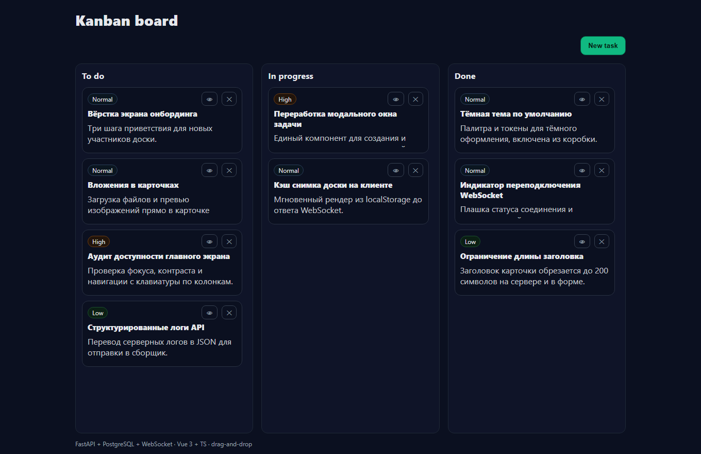
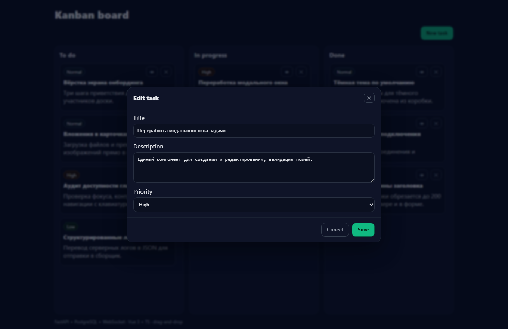
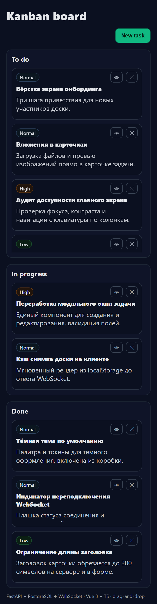
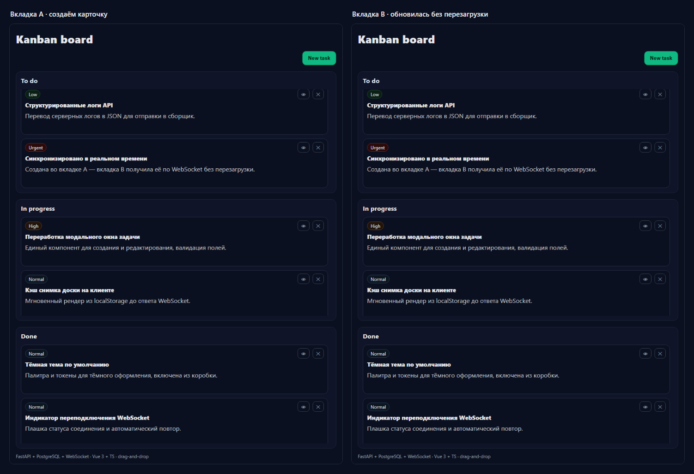
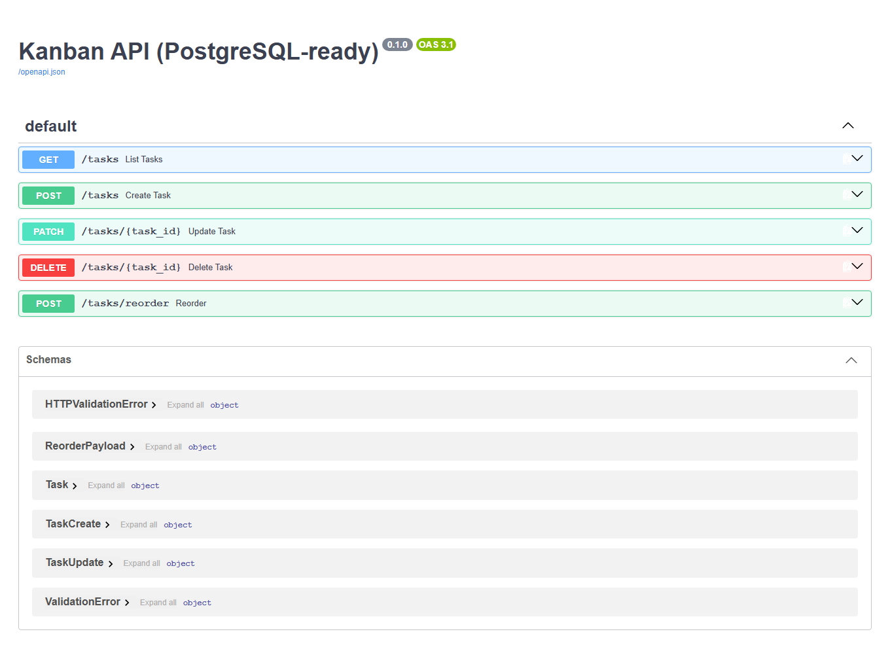

# Kanban-доска с синхронизацией в реальном времени

Общая канбан-доска: задачи в трёх колонках, перетаскивание карточек мышью и
мгновенное обновление у всех, кто открыл доску. Состояние целиком хранится в
базе данных, поэтому оно переживает перезагрузку страницы и обрыв связи — при
переподключении клиент получает полный снимок доски и продолжает работу.



## Возможности

- три колонки — To Do, In Progress и Done;
- создание, редактирование и удаление карточек с описанием и приоритетом;
- четыре уровня приоритета — low, normal, high и urgent;
- перетаскивание карточек внутри колонки и между колонками с сохранением порядка;
- изменения любого клиента сразу расходятся по остальным через WebSocket;
- полный снимок доски при подключении и после разрыва соединения;
- REST API для всех операций с карточками.

## Интерфейс

| Редактирование карточки | Мобильная раскладка |
| --- | --- |
|  |  |

Обновление в реальном времени: карточка, созданная в одной вкладке, сразу
появляется в другой.



Интерактивная документация REST API — Swagger UI на `http://localhost:8000/docs`.



## Стек

- Vue 3, TypeScript, Vite 5 — клиент;
- FastAPI, SQLAlchemy 2 (async), Pydantic 2 — сервер;
- PostgreSQL 16, WebSocket — хранение и синхронизация (SQLite — для локального режима без Docker);
- ESLint, Prettier, Ruff — линт и форматирование;
- Docker Compose — инфраструктура.

## Структура

```text
client/             клиент на Vue 3 + Vite
client/src/         компоненты доски, REST- и WebSocket-клиент
server/             приложение FastAPI
server/app/         модель, схемы, REST-маршруты и WebSocket
docker-compose.yml  сервисы web, api и база PostgreSQL
```

## Запуск

Требуются Docker и Docker Compose.

```bash
docker compose up --build
```

- приложение: http://localhost:5173
- API: http://localhost:8000
- Swagger UI: http://localhost:8000/docs

Остановить и удалить данные:

```bash
docker compose down -v
```

## Локальная разработка

Требуются Node.js 20+ и Python 3.11+. Без Docker сервер по умолчанию работает на
SQLite, отдельная база не нужна; при необходимости скопируйте `.env.example` в
`.env` и укажите `DATABASE_URL`.

Сервер:

```powershell
python -m venv .venv
.venv\Scripts\Activate.ps1
pip install -r server/requirements.txt
python server/uvicorn_config.py
```

- API: http://localhost:8000

Клиент:

```powershell
Set-Location client
npm ci
npm run dev
```

- клиент: http://localhost:5173

## Конфигурация

| Переменная | Назначение |
| --- | --- |
| `DATABASE_URL` | строка подключения SQLAlchemy; по умолчанию локальный SQLite, в Docker Compose — PostgreSQL |
| `VITE_API_URL` | базовый адрес REST и WebSocket для клиента; по умолчанию `http://localhost:8000` |

Полный список — в [`.env.example`](.env.example).

## API

| Метод | Путь | Назначение |
| --- | --- | --- |
| `GET` | `/tasks` | список всех карточек |
| `POST` | `/tasks` | создать карточку в колонке To Do |
| `PATCH` | `/tasks/{id}` | изменить заголовок, описание, приоритет или статус |
| `DELETE` | `/tasks/{id}` | удалить карточку |
| `POST` | `/tasks/reorder` | новый порядок и распределение карточек по колонкам |
| `WS` | `/ws` | снимок доски при подключении и поток изменений |

## Команды

```bash
cd client
npm run lint     # ESLint
npm run build    # сборка Vite
```

Конфигурация Ruff для линта сервера — в `server/pyproject.toml`.

## Деплой

Отдельного продакшн-URL нет: приложение разворачивается на любом Docker-хосте той
же командой `docker compose up --build`, что и локально. Поднимаются три сервиса —
`web`, `api` и `postgres`; данные PostgreSQL хранятся в томе `pgdata`.
